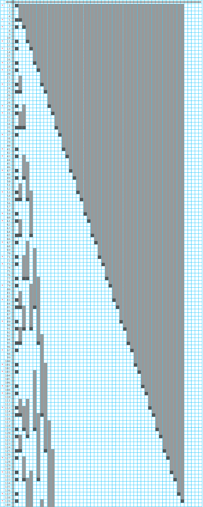

# Prime Identification Without Using Numbers

Author: Kilton Hopkins

Email: info@engineeringenlightenment.org

Public release: 11/5/2024

This paper describes an alternative process for identifying prime numbers that does not require the use of numbers or mathematical operations. The process can be completed in ways that are highly visual but also allows for a vast variety of approaches. With relatively few steps, a focus on repetition, and a fair amount of inherent flexibility, the process should allow for creativity and novel implementation by any interested and resourceful individual. Reference illustrations are provided within the flow of the text and a separate full illustration image file accompanies the paper. Additionally, a video walkthrough of the process being completed using a pencil, an unmarked ruler, and graph paper is available at [https://www.youtube.com/watch?v=p_wIaxijbnQ](https://www.youtube.com/watch?v=p_wIaxijbnQ)

## Introduction

All of the prime numbers can be correctly identified using only direct measurements, which can be captured in nearly any form, and without the use of numbers or mathematical operations. I am excited by the new perspectives we will see and the new things we will learn via the creativity and ingenuity of individuals who enjoy experimenting with this process.

A concept called dynamic quantization is at the heart of the process. It is the mechanism that enables successful repetition of a simple and straightforward pattern. I describe it with a good amount of detail, and expand into poetic language at times. Sometimes poetic phrasing can convey far more information and (hopefully) result in deeper understanding. It will always be tethered to a factual foundation and will be, at least, an interpretation of factual phenomenon worth exploring or considering for a moment.

## Dynamic Quantization

Dynamic quantization is the ability to define and redefine the indivisible, fundamental building block called the quantum unit. In the case of number systems, this means we have the ability to revise the definition of 1 whenever needed. Additional work exploring dynamic quantization further is forthcoming in separate papers.

To work with dynamic quantization and visualize it, any unit-based structure is suitable, such as graph paper or rows of tiles or pieces of fabric cut to the same size. Imaginative structures and resourceful thinking may yield surprising beneficial results.

When dynamic quantization is used in systems that have patterns, any new measurement that replicates the attributes of the existing quantum unit can be used as a quantum unit, too, and that makes it eligible to repeat the patterns.

The process of dynamic quantization is different for each situation. For the activity of identifying the prime numbers, which we are performing here, it is quite simple. Fortunately, every measurement we take is guaranteed to function properly as a quantum unit, which means it will be compatible with every step we take. And if we set that measurement equal to 1, then we can't tell the difference between the system version with the existing quantum unit definition or the version with the new measurement.

Because every measurement is compatible, we can simply "put a box around it" and make it the start of its own number line, and run the pattern.

The establishment of a new measurement as a quantum unit is the establishment of a new "number universe" in which the new quantum unit is 1, the pattern repeats identically, and 0 is a reference back to an origin point, which may be any quantity of layers below. The quantity and structure of layers below must be unknown, otherwise additional information regarding the order of layers (a specific type of information called "sequence") is inserted into the overall system and the prior structure changes. It can no longer be a functional crystal replication of the original pattern.

From the point of view of any particular layer, what lies behind 0 is undefined, so I will often write this reference to origin as  to show both the standard zero (0) and a symbol that I regularly use for things that are undefined .

What quantity from the prior layer is stored within the quantum unit we see as 1 is not known from within our layer, either. But we do know that the pattern we see is the pattern that was used to create us.

And somewhere in the measurements we record as we follow the pattern, taking the same steps that were taken before in some unknown place and expressed in some unknown language and its symbols, and which resulted in the creation of our local universe... we will encounter ourselves, in a form that we may or may not recognize, but which nonetheless contains information pertinent to our world. By identifying the place in the pattern that matches our universe, we can know something about the layer that gave rise to us.

The layout of measurements, their values and where they fall, and how they relate to each other, as we follow the pattern, are known to us because we assisted in creating them by observing them. The pattern created them already, so their existence is embedded in the pattern itself. Every measurement in the progression ahead of us already exists, and each becomes manifest in our layer as it is observed.

Dynamic quantization, as a concept and as a process, is useful in many scenarios. With regard to the generation of a number line as we know it and the identification of primes, it results in a numeric layout that is something like a map, with intersections denoting crossover points which allow for the movement of information between different encodings with no loss of fidelity. They are pathways between compatible systems, creating the compatibility in the form of the pathway itself, which comes into existence at the point of intersection of two or more number universes as they expand through the process of repeating the pattern for themselves.

## Measurement

For a measurement approach or technique to be viable for use in dynamic quantization, it must meet a set of criteria that determine if it is possible that it will produce erroneous measurements or not. These attributes or characteristics of a measurement approach, which is a tool, are the things that matter. We are seeking a tool that will give us these measurement characteristics, as opposed to spending effort figuring out how to correct the results of a familiar measurement tool we assumed we need to use.

We need the ability to take a measurement of a single "sealed package" unit, called a quantum, and always get a measurement result that can be identified correctly as that quantum unit every time without fail.

We also need the ability to place quantum units, which are identical and therefore interchangeable, in relationship to each other in a way that will always tell us the same relationship information, no matter how we look at it, as long as we don't change the placement.

As an example, we can stack boxes, one on top of another, and it doesn't matter whether we look with our head tilted sideways, or if we count from top to bottom instead of bottom to top... we always get the same information about how many boxes are found between where we start and where we stop measuring.

We need the ability to take measurements whenever we want and whereever we want without causing a change in the thing we are measuring or, in less ideal circumstances, we cause a change when we measure but we can keep track of the changes or we can restore the system to the pre-measured state as needed.

And we need the ability to take the same measurement, as many times as we want, and always get the same result as long as the thing we are measuring hasn't changed.

A grid made of identically sized boxes, such as graph paper, is an excellent tool for illustrating dynamic quantization and performing the process of identifying the prime numbers without using numbers because the measurement requirements are already met by the layout on the page. The smallest unit, which is a single box, cannot be anything other than one, as long as we stick to the predefined boxes in the grid.

## The Pattern

We will follow a simple pattern that repeats over and over, and we will only use this single pattern again and again.

The pattern is:

1. Pick a starting space that is exactly the size of the quantum unit we are currently working with and occupy that space. This marks the pattern starting point.

2. Then move by four quantum units and occupy that space, too.

3. Then move by two quantum units and occupy that space, as well.

4. Repeat steps 2 and 3.

It should look like this:

The reason that the pattern looks like this, with the spacing that it has, is because the numbers 2 and 3 in the number line interact with each other in a way that produces periodic intersections where they are compatible with each other and also periodic protected spaces immediately adjacent to the intersections, one on each side of the intersection, which are compatible with neither 2 nor 3.

These protected spaces are suitable for housing the unbreakable definition of 1. They are spaces suitable for dynamic quantization. Only numbers found in these spaces are eligible for the dynamic quantization we use here for our activity.

More thoughts on the emergence of the pattern will be in a separate upcoming paper.

## The Process

We are going to make a set of paths. Start with the single quantum in a place where you can make more paths next to it as you go. All paths need to be able to have a copy of the same starting point. On graph paper, this means we need to keep enough space available to add more columns that start on the same row, or add more rows that start on the same column.

Follow the pattern in a straight line to make the first path. This is the root layer. It is the basis of measurement for the system. The quantum unit associated with this path is the language we will use to describe everything we observe.

As we follow the pattern, marking spaces as "occupied" as we go along, we are observing measurements. The measurement is the distance from the starting point to the newly occupied space.

There is no need to count boxes (quanta) and any method of marking the measurement will work, such as cutting lengths of string or paper, or placing a pencil mark on a piece of wood.

It is important to avoid the allure of counting quantum units, which is "using numbers" because this pattern and process and all of its results, which are essentially the structural skeleton of the number line we know and love, will emerge the same, time and time again, wherever measurement allows for the counting of discrete things and there is something there to do the counting. The pattern exists before the numbers, symbols, and language used to describe it.

For each measurement, check if it is a "new" measurement, which means that we have just placed a mark to occupy the space at that distance for the first time, including marks placed across all of the other pattern lines (other pattern lines will be explained next).

If it is a new measurement, capture the measurement using your preferred method. I like to just place my finger on a ruler or a metal rod or anything straight. Then pick an empty path next to the last path being used, and mark the whole measured amount as occupied on that path, starting at the same starting point as every other path.

It is best to mark the last quantum unit space differently than the ones before it in the measured amount. Refer to the illustration immediately below for an example. This is helpful because we will use the last space it occupies as the place to match up the measured amount "chunks", which are new quantum unit definitions, with the layer that all layers have in common. That common layer is our root layer, which is the basis of all of our measurements.

If it is not a new measurement, do nothing. Although you may want to connect all of the measurement marks that land at that distance using some indicator, such as drawing a line or an arc between the measurement marks. These are prime number intersections.

For every path that has already been started, continue to follow the pattern using the quantum unit defined for that path. The quantum unit of each path is used both for occupying the correct amount of space and for skipping space along the straight line path according to the pattern.

It doesn't matter if you fill in all paths all the way to the point where you want to stop, or if you do a little bit of each path as a cycle and do many cycles. It will always come out the same. But if you want your layout (map) to look more ordered and tidy, you should do a little bit of pattern mapping on each path regularly. The goal is to stay ahead of the root layer. This will result in a nicely ordered layout, with bigger and bigger quantum unit definitions as you look along the set of layers.

Whenever you have reached a place on the paths where you want to collect the prime numbers, just make sure that the pattern has been filled in for all paths up to your current stopping point, and then proceed to finally add numbers to your layout so you can collect the primes you have mapped.

Using an open path (preferably right next to the root layer path to make everything easier), use your favorite number base and set of digit symbols to expose the number line. The standard numbers we use daily are number base 10 (decimal) and the digit symobls are, of course: 0, 1, 2, 3, 4, 5, 6, 7, 8, and 9

On your number sequence path, put 1 in the starting point space. Put the next number in the next space and keep going until you reach your stopping point.

Now you can simply collect the list of primes. All of the numbers that have only two occupied spaces will be prime (as you look across all layers). You can mark them on your layout or put them on a list somewhere, if you prefer. And, optionally, you can add the numbers 2 and 3 to the list.

## Example

A completed example of the entire prime number identification mapping activity is provided below. The process was completed up to number 140. The red asterisk symbols found on the left-hand side of the layout indicate prime numbers. No red asterisk was added manually for numbers 2 and 3 in this example.

